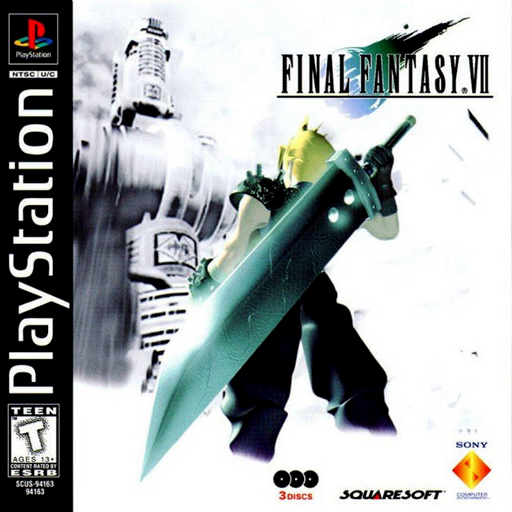

# Final Fantasy 7

<!-- retcomm-readme-metrics -->
[](https://github.com/TechnicallyComputers/Final-Fantasy-7/releases)
[](https://github.com/TechnicallyComputers/Final-Fantasy-7/releases/latest)
[](https://github.com/TechnicallyComputers/Final-Fantasy-7/releases/latest)
<!-- /retcomm-readme-metrics -->

<!-- retcomm-readme-boxart -->
<p align="center">
  
</p>
<!-- /retcomm-readme-boxart -->

Static recompilation of **Final Fantasy 7** built on
[psxrecomp](https://github.com/mstan/psxrecomp) and
[recomp-ui](https://github.com/mstan/recomp-ui).

The Western release of Final Fantasy VII (released as Final Fantasy VII International in Japan) included additional elements and alterations, such as streamlining of the menu and Materia system, reducing the health of enemies, new visual cues to help with navigation across the world map, and additional cutscenes relating to Cloud's past.

| | |
|---|---|
| Players | 1 |
| Region | USA |
| Publisher | Square Enix |
| Year | 1997 |

Scaffolded with the New Project Layout. See
`psxrecomp/docs/GAME_PROJECT_SETUP.md` for the full flow.

<!-- retcomm-readme-launcher -->
## RetComM Launcher

You can run this title **standalone** (release zip + the built-in recomp-ui
Generate & Build flow), or manage installs, updates, ROM/BIOS wiring, and queued
builds more intuitively with
**[RetComM Launcher](https://github.com/TechnicallyComputers/RetComM-Launcher)** —
the Retro Compilation Manager hub for self-compiling recomps.

[Downloads](https://github.com/TechnicallyComputers/RetComM-Launcher/releases) ·
[Full README & features](https://github.com/TechnicallyComputers/RetComM-Launcher#readme)

<p align="center">
  
</p>

<p align="center">
  
</p>

RetComM checks for updates, rebuilds with existing build data when possible,
shares the portable toolchain used by per-title launchers, and automates
BIOS/ROM/save plumbing so you are not stuck repeating each game’s wizard by hand.
<!-- /retcomm-readme-launcher -->

## Symbols and source-level modding

The recompiled C is generated from the disc, so out of the box every function
is named `func_800257CC`. `symbols.toml` and `symbols_overlays.toml` put names
back on ~1,100 of them, imported from the
[ff7-decomp](https://github.com/Xeeynamo/ff7-decomp) symbol map by Xeeynamo and
contributors — see `THIRD_PARTY_ATTRIBUTION.md` for provenance, licence status,
and what may and may not be taken from that project. **Their source is not used
here and must not be merged**; only the address tables were read.

```sh
python3 tools/import_decomp_symbols.py                    # refresh from the pinned commit
python3 tools/import_decomp_symbols.py --verify-generated  # corroborate against our own codegen
python3 tools/sync_symbols.py                             # maps -> psx_symbols.h
python3 tools/sync_symbols.py --check-hooks               # game.toml agrees with the map
```

Host and mod code addresses functions by name — `PSX_FN_SetupGamepad`, not a
hex literal. Setting `hook = true` on an entry makes the recompiler emit a
`psx_mod_function_entry()` call at that function; `src/ff7_mods.c` registers
trusted plugin callbacks against them, and `game.toml`'s address list is
derived from the map rather than hand-maintained.

Imported names are `status = "contextual"` — evidence-backed but **not verified
by us**. The default-off *Hook Trace (developer)* feature in the Mods list is
how you promote one: arm it, do the thing the name claims to describe, and see
whether the call fires.

## Legal

You must own the original game. Disc images under `disc/` are gitignored and
must never be committed. Retail BIOS dumps are not redistributed; OpenBIOS is
used for Generate unless you supply your own SCPH locally.

Default app icon: `assets/psxrecomp.ico` (and `.png` / `.svg`) — RetComM-themed controller mark from `psxrecomp/assets/`. Windows builds embed it via `APP_ICON`.

Optional box art under `launcher_assets/img/` may come from
[libretro-thumbnails](https://github.com/libretro-thumbnails/libretro-thumbnails)
(`Named_Boxarts`); see `BOXART_SOURCE.txt` when present.

## Quick start (dev)

```bash
git submodule update --init --recursive
./psxrecomp/tools/ci/build_emitters.sh
python3 psxrecomp/psxrecomp_cli.py generate \
  --config game.toml --project-root . --disc disc/<your>.cue
cmake -S . -B build-release -G Ninja -DCMAKE_BUILD_TYPE=Release
cmake --build build-release --target psx-runtime
```

Zip prefix for CI artifacts: `finalfantasy7`.

## Symbols

Progressive map: `symbols.toml` → `python3 tools/sync_symbols.py` →
`psx_symbols.h` (`PSX_FN_*`). See `psxrecomp/docs/SYMBOLS.md`.

## Framework pins

Submodule gitlinks (`psxrecomp`, optional `recomp-ui`, nested `recomp-net`)
are authoritative. `framework_pins.txt` is an optional scaffold snapshot;
release CI logs SHAs with `record_pins.sh` but builds whatever the gitlinks
resolve to. Bump submodules deliberately — do not float on `main`/`master`
in release CI.

<!-- retcomm-readme-raid -->
---

<p align="center">
  <sub><b>R.A.I.D. — Retro AI Development</b> · a Discord for AI-assisted retro reverse-engineering, decomp &amp; recomp</sub>
</p>

<p align="center">
  <a href="https://discord.gg/Ad9BwSzctP"></a>
</p>
<!-- /retcomm-readme-raid -->
